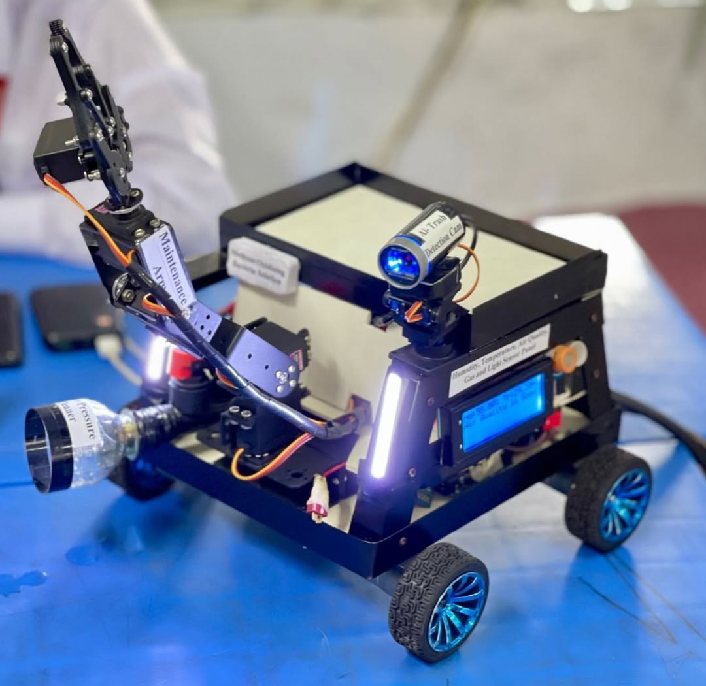

 

</a>

 

<h3 align="center">👨‍💻 About Me</h3>

  I am an R&D Lead and Founder bridging the gap between <b>advanced robotics</b> and <b>rural problem-solving</b>.  
  My work focuses on autonomous environmental systems, low-cost AI implementation, and mentoring the next generation of STEM innovators.

---

<h2 align="center">🛠 Tech & Tools</h2>

<table>
  <tr>
    <td align="center" width="25%">
      <strong>Languages</strong>  
      
      
      
      
    </td>
    <td align="center" width="25%">
      <strong>AI & Vision</strong>  
      
      
      
      
    </td>
  </tr>
  <tr>
    <td align="center" width="25%">
      <strong>Hardware & IoT</strong>  
      
      
      
      
    </td>
    <td align="center" width="25%">
      <strong>Tools & Design</strong>  
      
      
      
      
    </td>
  </tr>
</table>

---
<h2 align="center">🤖 Projects & Repositories </h2>

| Preview | Project | Description | Tech/Tools |
| :---: | :---: | :---: | :---: |
|  | *AI Assisted Drainage & Sewage Maintenance Robot* | 🚜 An autonomous robot with a mechanical arm, AI camera, and sensors to replace dangerous manual drainage cleaning. | C++, IoT, Sensors, Python, OpenCV, TensorFlow |
|  | *Flexi-Grow: AI-Enabled Soft Robot for Exploration* | 🌿 A textile-based soft-growing robot, driven by AI and pneumatics, designed for search & rescue in narrow terrains. | ESP32, ESP-NOW, FPV Camera, Soft Robotics, Python, Textile Eng |
|  | *Low-cost ML-Based Water Contamination Detection* | 💧 Low-cost ML-powered device detecting micro-pollutants with ~90% accuracy using SSD MobileNet V2. | TensorFlow Lite, Python, PyTorch, OpenCV |

---
<h2 align="center">🎖 Honors & Achievements</h2>

| Event | Award | Location |
| :---: | :---: | :---: |
| *International Robot Olympiad (IRO)* | 🥈 Silver Medal 🥉 Bronze Medal | South Korea |
| *World Robot Olympiad (WRO) OC* | 🌏 Best Startup Award | Philippines |
| *Government ICT Division* | 🏆 Honor of Recognition Award | Bangladesh |
| *Stockholm Junior Water Prize* | 💧 Seed Funding Winner | Based on Sweden |
| *Codeavour 5.0 International* | 🥇 Gold Medal | Invited in Dubai |
| *Codeavour 6.0 International* | 🥇 Gold Medal | Invited in Qatar |
| *National STEM Olympiad* | 🏆 Runner Up | Bangladesh |

---
<h2 align="center">📢 Community & Leadership</h2>

### 🚀 *Founder & CEO @ SAPH.Ai*
> Leading robotics & coding teams to address rural/urban challenges. We translate research into reliable technology and have secured seed funding for field implementation.

### 👨‍🏫 *Academic Mentor & R&D Intern @ International Robot Olympiad, Bangladesh*
> Returned as an alumni guide to mentor genius minds and national teams preparing for the International Robot Olympiad, providing real-time guidance on robot building.

---

  

